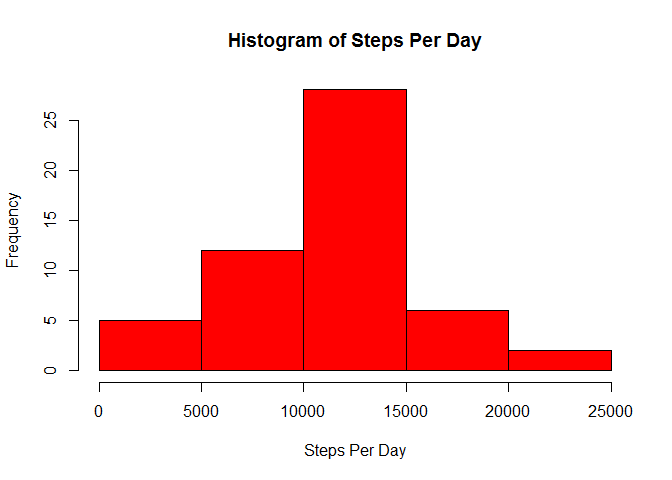
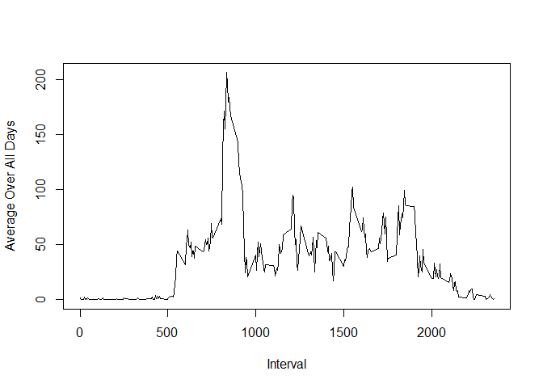
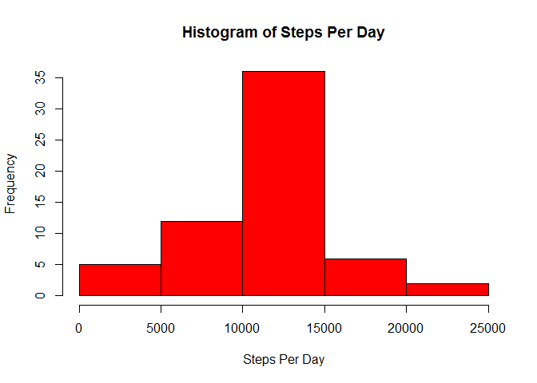
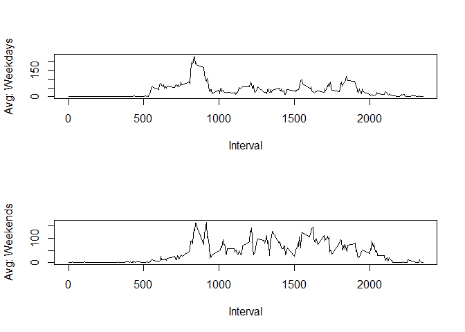

# Reproducible Research: Peer Assessment 1


## Loading and preprocessing the data

```r
  ## Read all data
  dat <- read.csv("activity.csv")
  
  ## First ignore missing values to get sums per day (aggregate does by default)
  sums <- aggregate(steps ~ date, data = dat, sum)

  ## Produce a histogram of the steps per day
  hist(as.numeric(sums$steps),
         main="Histogram of Steps Per Day", 
         xlab = "Steps Per Day",
         col = "red")
```



## What is mean total number of steps taken per day?

```r
  ## Mean and median of steps per day
  mean(sums$steps)
```

```
## [1] 10766.19
```

```r
  median(sums$steps)
```

```
## [1] 10765
```

## What is the average daily activity pattern?

```r
  ## Compute the mean for each time period interval
  intmeans <- aggregate(steps ~ interval, data = dat, mean)
  
  ## Plot of the interval average across all days
  plot(intmeans$interval, intmeans$steps, type = "l", xlab = "Interval", ylab = "Average Over All Days")
```



```r
  ## Find the interval with the max value
  intmeans[which(intmeans$steps==max(intmeans$steps)),1]
```

```
## [1] 835
```

## Imputing missing values

```r
  ## Count the number of missing values
  missval <- sum(is.na(dat$steps))
  
  ## Replace all NAs with the mean for that time period:
  ## First merge with interval means and sort
  mrg <- merge(dat, intmeans, by = "interval")
  newdat <- mrg[order(mrg$date),]
  ## Now replace NA steps with average
  my.na <- is.na(newdat$steps.x)
  newdat$steps.x[my.na] <- newdat$steps.y[my.na]
  
  ## Calc sums for new data (replaced NAs with interval average)
  sumsnewdat <- aggregate(steps.x ~ date, data = newdat, sum)
  
  ## Produce a histogram of the steps per day
  hist(as.numeric(sumsnewdat$steps),
       main="Histogram of Steps Per Day", 
       xlab = "Steps Per Day",
       col = "red")
```



```r
  ## Mean and median of steps per day - new data
  mean(sumsnewdat$steps)
```

```
## [1] 10766.19
```

```r
  median(sumsnewdat$steps)
```

```
## [1] 10766.19
```

## Are there differences in activity patterns between weekdays and weekends?

```r
  ## Add day and timeofweek to newdat
  newdat$day <- weekdays(as.Date(newdat$date))
  newdat$timeofweek <- ifelse((newdat$day == "Sunday" | newdat$day == "Saturday"), "weekend", "weekday")
  
  par(mfrow = c(2,1))
  
  ## Get time series plot for weekdays and weekends
  intmeanweekday <- aggregate(steps.x ~ interval, data = subset(newdat, timeofweek == "weekday"), mean)
  intmeanweekend <- aggregate(steps.x ~ interval, data = subset(newdat, timeofweek == "weekend"), mean)
  plot(intmeanweekday$interval, intmeanweekday$steps, type = "l", xlab = "Interval", ylab = "Avg: Weekdays")
  plot(intmeanweekend$interval, intmeanweekend$steps, type = "l", xlab = "Interval", ylab = "Avg: Weekends")
```



